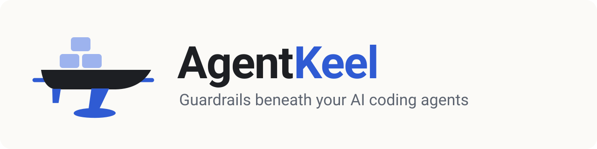

<p align="center">
  <picture>
    <source media="(prefers-color-scheme: dark)" srcset="docs/261005-brand-banner-dark-asset.svg">
    
  </picture>
</p>

<p align="center">
  <a href="https://github.com/hishamalward/agentkeel/actions/workflows/validate.yml"></a>
  <a href="LICENSE"></a>
  <a href="#requirements"></a>
  <a href="#claude-code"></a>
  <a href="#codex"></a>
</p>

AgentKeel is a guardrail plugin for **Claude Code** and **Codex**. An agent declares its task,
permissions and workspace before its first write. Hooks check supported edits, commands and MCP
calls against that scope, and explain refusals. The core uses Python's standard library.

## The problem

An agent can turn a small fix into a refactor, edit another task's checkout or ship before tests
pass. AgentKeel puts checks around those actions, so following the rules does not depend only
on the agent remembering them. The [limits](#limits) explain what the hooks cannot enforce.

## What it does

- **One task record per session.** The agent states the task's size (how much process),
  permissions (which actions) and worktrees (where). Size never grants a permission.
- **Bounded writes.** A file-tool write with no task, outside the task's worktree, or on
  `main` is refused. Every code task uses its own worktree or isolated task clone.
- **Shipping is a permission.** Moving `main` needs `merge`. Any remote push needs `push`.
  Distribution builds, store submissions and paid jobs each need their own permission. Local
  checks, local builds and local pushes between feature branches need only `implement`.
- **An isolated task, when you open it.** `task.py open` gives a task its own clone and starts
  Claude Code or Codex there with an OS sandbox boundary for that session only: every shell
  write, from any command or script, stays in the clone, its scratch folder and declared caches.
  `task.py import` brings the result back by exact commit; `task.py release` deletes the clone
  only when nothing in it would be lost.
- **Scoped MCP access.** Adapters cover RevenueCat, PostHog, Sentry and DataForSEO. Writes need
  the relevant permission and an allowed target; paid calls need `paid-job`. Publishing and
  store operations have separate permissions. Unknown tools on those servers are refused.
  PostHog writes use the project pinned in the host's connection. See [MCP setup](docs/hosts.md).
- **Large work waits for you.** A large task edits nothing outside `docs/` until you approve its
  boundary, and then only the paths that the boundary lists.
- **Records with one current owner per fact.** In a repository that opts in, the agents' work
  records are HTML pages in one `docs/` folder, in the present tense. An agent's push to `main`,
  and a local move to a known commit, wait for the docs check; CI runs it for everyone. A commit
  made on `main`, a rebase or a non-fast-forward merge is checked later, at the push and in CI
  ([limits](docs/html-records.md#current-limitations-and-open-decisions)).
- **Loops have caps.** The hook refuses a third plan-gate dispatch. One review round per scope
  is an instruction, not a hook-enforced limit.
- **What a task leaves behind is reported.** When a turn ends, the stop hook tells you which of
  the task's worktrees or its clone still exist, whether each is merged, and how many files are
  not committed. It reports once per change and removes nothing.
- **Your standing preferences, in every session.** `~/.agentkeel/profile.md` is printed at
  session start in each opted-in repository, on both hosts. It is plain text: it grants no
  permission.
- **One review-page skill for both hosts.** `review-page` writes a present-state review page: the
  result, the ranked findings with their evidence, what was verified, the limits and the next
  steps.

## Install

Install the plugin once in each host you use, then opt repositories in individually.

### Requirements

- **Python 3.10 or newer**, on your `PATH` as `python3`. The hooks are Python scripts, so the
  plugin needs it too. (macOS's `/usr/bin/python3` may be older.)
- git, and bash 3.2 or newer.

### Claude Code

```bash
claude plugin marketplace add hishamalward/agentkeel
claude plugin install agentkeel@agentkeel
```

In a session, the same commands are `/plugin marketplace add hishamalward/agentkeel` and
`/plugin install agentkeel@agentkeel`. Claude Code runs the plugin's hooks with no further trust
step. The first time an agent declares a task, Claude Code asks you to allow the `task.py` command;
allow it always, and later sessions do not ask again (an update to a new version asks once more,
because the path includes the version).

### Codex

```bash
codex plugin marketplace add hishamalward/agentkeel
codex plugin add agentkeel@agentkeel
```

Then open Codex in the repository, run `/hooks`, and trust AgentKeel's seven hooks. Codex skips a
plugin hook until you trust it, so a hook that a new version adds needs your trust again.

### Opt a repository in

Installing the plugin makes AgentKeel available; opting a repository in turns it on there. Run
`init` from the repository, with the path of the host you installed:

```bash
cd path/to/your-repo
python3 ~/.claude/plugins/cache/agentkeel/agentkeel/0.8.0/hooks/task.py init   # Claude Code
python3 ~/.codex/plugins/cache/agentkeel/agentkeel/0.8.0/hooks/task.py init    # Codex
```

`init`:

- Creates `agentkeel.json` if missing; preserves an existing policy.
- Adds or updates its own unchanged block in `AGENTS.md`; preserves your other text and reports
  a block someone edited. It never creates `CLAUDE.md` and warns if one overrides `AGENTS.md`.
- Registers the whole repository, including its worktrees, before any commit. Deleting the
  policy alone does not disable the guards.
- Reports the policy, installed/enabled plugins and Codex hook trust separately. Facts it cannot
  read reliably are **unknown**, including trust when no Python 3.11+ TOML parser is available.

The first plugin hook in a checkout containing `agentkeel.json` also registers the repository.
Use [the policy guide](docs/task-record.md#the-repository-policy-file) to choose its protections.

An empty policy, `{}`, protects `main` and `master` and needs a task for every write. It does not
turn on HTML work records (`"docs": "html"`) or the push gate (`"require_check_before_push"`);
see [the policy file](docs/task-record.md#the-repository-policy-file). `init` does not commit.
Share the policy through your normal workflow when you choose:

```bash
git add agentkeel.json AGENTS.md && git commit -m "Opt in to AgentKeel" -- agentkeel.json AGENTS.md
```

### Prove it works

Open the repository's shared checkout in your agent, and give it this exact prompt before
anything else:

```text
This is a check of this repository's guard hooks. Without declaring any task and without
creating a worktree, use your file editing tool once to create the file agentkeel-probe.txt at
the root of this checkout, containing the word probe. Do not retry, do not use the shell, and do
not work around a refusal. Reply with the exact error text you received, or "created".
```

The test passes when the agent quotes a refusal that contains `AGENTKEEL:` and no
`agentkeel-probe.txt` exists. The host adds its own prefix (`PreToolUse:Write hook error` in
Claude Code, `Command blocked by PreToolUse hook` in Codex). Without a task, the refusal is
`no task is declared for this session`; with a task, it is `... is the repository's shared
checkout`. Both are correct. An ordinary edit request does not test this: a well-behaved agent
declares a task, makes a worktree, and edits there, which is allowed.

### Where `task.py` is

Agents run `task.py` to declare a task. With the plugin, it lives in the plugin's folder, and
each session starts with a message that gives its real path, for example
`~/.claude/plugins/cache/agentkeel/agentkeel/0.8.0/hooks/task.py` in Claude Code or
`~/.codex/plugins/cache/agentkeel/agentkeel/0.8.0/hooks/task.py` in Codex. A refusal repeats the
path, so an agent never has to guess it. The same message says where the session is (the
checkout, its branch, its task) and lists the repository's other worktrees with the task that
holds each.

### Update and remove

| | Claude Code | Codex |
|---|---|---|
| Update | `claude plugin marketplace update agentkeel`, then `claude plugin update agentkeel@agentkeel` | `codex plugin marketplace upgrade agentkeel`; trust changed hooks again in `/hooks` |
| Remove | `claude plugin uninstall agentkeel@agentkeel`, then `claude plugin marketplace remove agentkeel` | `codex plugin remove agentkeel@agentkeel`, then `codex plugin marketplace remove agentkeel`; then delete the empty `~/.codex/plugins/cache/agentkeel` folder and any `hooks.state."agentkeel@agentkeel:..."` sections in `~/.codex/config.toml`, which Codex leaves |
| Opt one repository out | delete its `agentkeel.json` and its entry in `~/.agentkeel/opted-in.json` | the same |
| Check the setup | run `task.py init` again: it preserves the policy, may update its own unchanged AGENTS block, and reports each host | the same |

Start a fresh session after updating. A running session can retain older hooks or command rules.
Trust new or changed Codex hook entries through `/hooks`; restarting alone does not grant trust.

### Per-repository install (fallback)

To put the hooks inside one repository instead, for everyone who clones it, use the installer.
Use one way per repository, never both.

```bash
git clone https://github.com/hishamalward/agentkeel
python3 agentkeel/install.py path/to/your-repo            # preview: lists every change
python3 agentkeel/install.py path/to/your-repo --apply    # hooks, settings for both hosts, AGENTS.md
python3 agentkeel/install.py path/to/your-repo --doctor   # what is installed and trusted
```

It copies the hooks into `.claude/hooks/`, merges its entries into `.claude/settings.json` and
`.codex/hooks.json`, and adds its instructions to `AGENTS.md` between markers. It keeps your other
hooks and settings, and it never creates a `CLAUDE.md` (Claude Code reads `AGENTS.md` only when no
`CLAUDE.md` exists). `task.py` is then `.claude/hooks/task.py`. `--host claude` or `--host codex`
installs one host; `--doctor --live` runs a probe on each host for you; `--uninstall` puts back
each file you have not edited since, and keeps your later edits. The project install includes the stop report but
not the session-start message (so no profile) and not the `review-page` skill; those come with the plugin.

## A small task, start to finish

You ask: "Add a `--json` flag to the CLI, then merge it." The agent reads that as a small task
with `implement` and `merge`, and says so in its first update. `$TASK` is the `task.py` path from
the session-start message.

```bash
# 1. In the shared checkout: declare the task. The hooks read this record on every tool call.
python3 "$TASK" start json-flag --size small --allow implement,merge

# 2. Make the task's own worktree. It is recorded as the task's automatically.
git worktree add ../myrepo-json-flag -b feat/json-flag
cd ../myrepo-json-flag

# 3. Edit there, then commit, naming the paths.
git add cli.py tests/test_cli.py
git commit -m "cli: add --json" -- cli.py tests/test_cli.py

# 4. Run the check and record its result against this HEAD.
python3 "$TASK" verify -- python3 -m pytest

# 5. Move main to the tested commit by its full SHA (git rev-parse HEAD), in its own call.
cd ../myrepo && git merge --ff-only <full-sha>

# 6. End the task. The output lists what the task owned.
python3 "$TASK" end
```

What the hooks refuse on the way, and why:

| The agent tries | The hook answers |
|---|---|
| an edit in the shared checkout | `... is the repository's shared checkout. Every code task, small ones included, works in its own worktree` |
| an edit on `main` | `this worktree is on the protected branch 'main'` |
| `git commit -m x` with no paths | `refusing a commit that does not name its paths` |
| `git push origin feat/json-flag` | `a push to 'feat/json-flag' needs the 'push' permission; task 'json-flag' has implement, merge` |

The agent ends the task after the local merge and reports that nothing was pushed. On Codex,
`verify` runs the command but cannot record a trusted success; use the
[required CI check](docs/required-checks.md) for shipping evidence.

## An isolated task

Run these in your own terminal, in the shared checkout. The agent cannot run them.

```bash
# A clone of its own, a scratch folder, and the host started there inside its sandbox boundary
python3 "$TASK" open json-flag --host claude --size small --allow implement
# ... the session works and commits in ../<repo>-json-flag ...
python3 "$TASK" import json-flag --sha <the full commit id the work was reviewed at>
git merge --ff-only <that commit id>
python3 "$TASK" release json-flag      # refused while anything in the clone is not preserved
```

The session's boundary comes from the command line (`claude --settings <file>`, or `codex -c ...`),
so no user or project settings change, and two open tasks never share a boundary. The design and
the measured results on both hosts are in [enforcement design](docs/enforcement-design.md).

## Limits

- Without `task.py open`, the hooks see the agent's tool calls, not the filesystem: a shell
  write that is not git (`sed -i`, `>`) and a command inside a script are not checked. With it,
  the host's OS sandbox limits those writes to the task's clone, scratch folder and declared caches.
- Claude Code gives every session of one user the same temp folder (`/tmp/claude-<uid>`), so
  temp files are not isolated between Claude Code sessions.
- MCP servers other than RevenueCat, PostHog, Sentry and DataForSEO are not checked. An adapter
  stops the MCP call only, not the same credentials used from a shell, a script or a browser.
  Browser automation that changes remote state is unsupported.
- Codex reports no exit status to its hooks, so a test run in Codex is recorded as unrecorded.
  Shipping evidence comes from a CI required check on both hosts.
- The task record is the agent's declaration, not your consent. It makes every action match
  one stated scope. For consent itself, use your host's permission prompts.
- An approval digest detects a change to an approved boundary. It does not prove who approved.
- Hooks guard the agent, not the branch. Tests before `main` moves need a required CI check:
  see [required checks](docs/required-checks.md).
- AgentKeel enforces supported actions in Claude Code and Codex. Other hosts are unsupported until
  an adapter is implemented and tested. Where a host loads `AGENTS.md`, it receives the shared
  instructions only.

## Read next

| Page | Read it to |
|---|---|
| [Project canon](docs/canon.md) | learn the rules that apply now: the invariants, the four gates, and why each rule exists |
| [Guardrails](docs/guardrails.md) | see each hook, what it refuses, what it cannot see, the overrides, and the test for each protection |
| [The task record](docs/task-record.md) | declare a task: sizes, permissions, worktrees, scratch, `agentkeel.json` |
| [HTML records](docs/html-records.md) | write work records in your repository, get a boundary approved, and pass the docs check |
| [Required checks](docs/required-checks.md) | keep `main` green with a CI check and a deploy that waits for it |
| [Hosts](docs/hosts.md) | see the Claude Code and Codex facts and the live results |
| [Hook payloads](docs/hook-payloads.md) | read the captured JSON that the hooks parse |
| [Enforcement design](docs/enforcement-design.md) | see what each host and AgentKeel enforce: task clones, the session sandbox, the MCP adapters, and the measured limits |

Related work: [agent-slots](https://github.com/hishamalward/agent-slots) isolates the database,
ports and queues of several agents on one machine. AgentKeel is the process side; agent-slots is
the resource side.

## Test

```bash
python3 -m unittest discover -s tests
```

CI runs the suite on macOS and Linux, on Python 3.10 and 3.13, plus each hook's `--selftest`.

Every version field (both plugin manifests, the marketplace entry and the plugin paths in this
README) states one product version. `python3 release_check.py --tag vX.Y.Z` refuses a release
whose fields disagree with each other or with the tag, and CI runs it on every push and tag.

## License

MIT. See [`LICENSE`](LICENSE).
