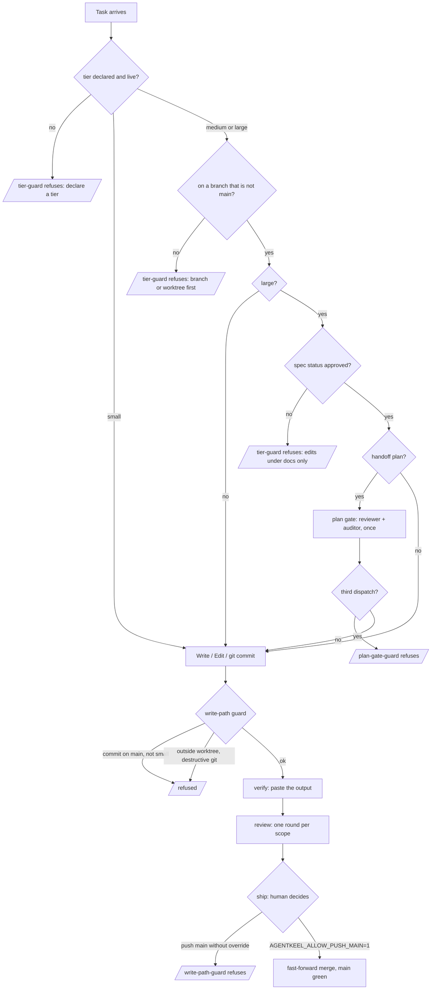

# How agentkeel works

> **v0.2 note (2026-10-04).** This document describes v0.1, where a "tier" was one declaration that
> also granted actions (`tier.sh`, `tier-guard.py`, `write-path-guard.py`). v0.2 replaced it with
> the task record: size, permissions and resources answered separately (`task.py`,
> `task-guard.py`; `DECISIONS.md` D-004 to D-007). The reasoning below stands; the hook names,
> state paths and override names do not. The present behaviour is in the README and
> `docs/task-record.md`.

For whoever owns this next, including me in six months. It assumes the README and aims to let
you defend every number without opening the code. `docs/spec.md` is the contract; this is the
tour.

## The story, in one paragraph

AI coding agents write code faster than anyone reviews it, and the failures are rarely in the
code: they are the missing gates, a one-file fix that became a refactor, a plan reviewed three
times, a check that could not fail, a commit on `main` that nothing stopped. Prose rules do not
hold because the session that drifts is the one that read them. agentkeel is the practice from
shipping a product with agents writing the code, made enforceable: three invariants (every write
bounded before it happens, every claim with its evidence, every loop capped and only a human
re-opens it), the tier declared once as state the hooks read, a spec whose criteria say who
verifies them, four gates with named owners, and six hooks that refuse the dangerous writes from
inside the harness. It deliberately does not do runtime isolation (agent-slots), per-file
enforcement of the spec's `Changes` list (next), or anything that needs a plugin. From this
repo's own artefacts: 49 tests, six refusals captured from one real `claude -p` run, and one hook
bug that run found and the tests now pin.

## One task

Every refusal is exit 2 with the reason on stderr, which the model reads as the tool result.

## The code, in call order

**`hooks/tier.sh` · the command.** Validates the tier and the kebab-case slug, finds the git
top-level, and writes `.claude/state/agentkeel-tier.json` with `tier`, `slug`, `branch`,
`declared_at`, `expires_at`; a change of tier is recorded as `previous` and noted on stderr.
**Why:** the tier is state rather than a sentence, so every guard can read what the work bought;
expiry (8 h) means yesterday's `small` cannot grant today's commit on `main`.

**`hooks/tier-guard.py` · `decide()`.** For a `Write`, an `Edit`, or a `Bash` containing `git
commit`, it resolves the worktree, exempts `docs/` and `.claude/`, then applies the ladder: no
live declaration refuses; `small` allows; `medium`/`large` refuse on `main`; `large` refuses
outside `docs/` until `docs/specs/<slug>-spec.md` says `status: approved`. **Why:** the safe
default is refusal with the one line that fixes it; an undeclared session that could write is
the hole the whole design exists to close.

**`hooks/write-path-guard.py` · `decide()`.** For `Bash`: destructive git patterns first, then
`git commit` on `main` (allowed only under `small`), then a `git push` whose target is `main`
(refspec parsed, `HEAD:main` included). For `Write`/`Edit`: the path must lie under the git
top-level, the project dir, or a temp root. **Why:** invariant 1 had no teeth in the practice
this came from; `main` auto-deployed, so a commit on it was a production change, and the
overrides echo so the transcript shows every time a guard was stepped around.

**`hooks/secret-guard.py` · `offending()`.** Splits the command on `;`, `&&`, `|`, blanks out
`$(...)` substitutions, and checks each segment's first word against the show-list (`cat` and
kin of `.env*` and key files, bare `env`/`printenv`, `echo` of a secret-named variable, `git
show|diff|log` of `.env`). **Why:** a secret may be used, not shown; `export $(cat .env |
xargs)` is using, `cat .env` is showing, and the substitution rule is what tells them apart.

**`hooks/plan-gate-guard.py` · `decide()`.** For an `Agent` dispatch naming
`docs/plans/*.md`, counts it in `.claude/state/plan-gates.json` if it carries `[plan-gate]` or
reads like a plan review, excluding task reviews and diffs; refuses past two. **Why:** the
allowance is two because one round is two agents in parallel; the marker exists because the
word heuristic can be dodged, and the README says so.

**`hooks/plan-size-guard.sh` · after every write.** If the written file is
`docs/plans/*plan*.md` and longer than 300 lines, exit 2 with the count and "a plan this long
is carrying code". **Why:** plans never carry code (D-001); three rules in the old practice were
workarounds for plans that did.

## The controls

| Hook | Blocks | Cannot see | Tested by |
|---|---|---|---|
| `tier-guard.py` | writes with no live declaration; medium/large on `main`; large outside `docs/` before spec approval | shell writes that are not `git commit`; who edited the spec's `status` | `tests/test_tier_guard.py` (11), selftest |
| `write-path-guard.py` | commit on `main` outside small; push to `main`; destructive git; edits outside the worktree | non-git shell writes; a `cd` into another repo | `tests/test_write_path_guard.py` (10), selftest |
| `secret-guard.py` | printing `.env*`, key files, the environment, secret-named variables | a program that prints the value; unknown file names | `tests/test_secret_guard.py` (10), selftest |
| `plan-gate-guard.py` | a third gate dispatch per plan | a dispatch worded around the heuristic | `tests/test_plan_gate_guard.py` (6), selftest |
| `plan-size-guard.sh` | a plan over 300 lines | a plan split across files | `tests/test_plan_size_guard.py` (4), selftest |
| `tier.sh` | bad tier, bad slug, no repo | | `tests/test_tier_command.py` (4), selftest |

Plus `tests/test_repo_contract.py` (4): the CLAUDE.md fragment is at most 60 lines, no em
dashes anywhere, every hook selftests, shell hooks parse.

## How to read the state

`.claude/state/agentkeel-tier.json` holds `tier`, `slug`, `branch` (informational; the guards
read the live branch), `declared_at` and `expires_at` as epoch seconds, and `previous` after a
re-declaration. `.claude/state/plan-gates.json` maps plan file name to gate dispatches used. A
spec's frontmatter `status` is what the tier guard reads; an inline `#` comment after the value
is allowed. Every refusal starts with the guard's name in capitals (`TIER GUARD:`, `WRITE PATH
GUARD:`, `SECRET GUARD:`, `PLAN GATE GUARD:`, `PLAN SIZE GUARD:`) followed by the reason and
the instruction. Every override is an environment variable (`AGENTKEEL_ALLOW_PUSH_MAIN`,
`AGENTKEEL_ALLOW_DESTRUCTIVE`, `AGENTKEEL_EXTRA_WRITE_ROOTS`, `AGENTKEEL_SHOW_SECRETS`) that the
hook echoes to stderr when used; grep the transcript for `override` to see every one.

## Interview answers

The canonical answers live in [`defending-the-framework.md`](defending-the-framework.md): why
gates instead of better prompts; how blast radius is stopped from widening mid-task; what a
hook catches that a CLAUDE.md rule does not; how you know it is working; the difference from
agent-slots. The rendered page reproduces them from that file.

## Check yourself

The five self-check questions, with folded answers, are at the end of
[`defending-the-framework.md`](defending-the-framework.md).
